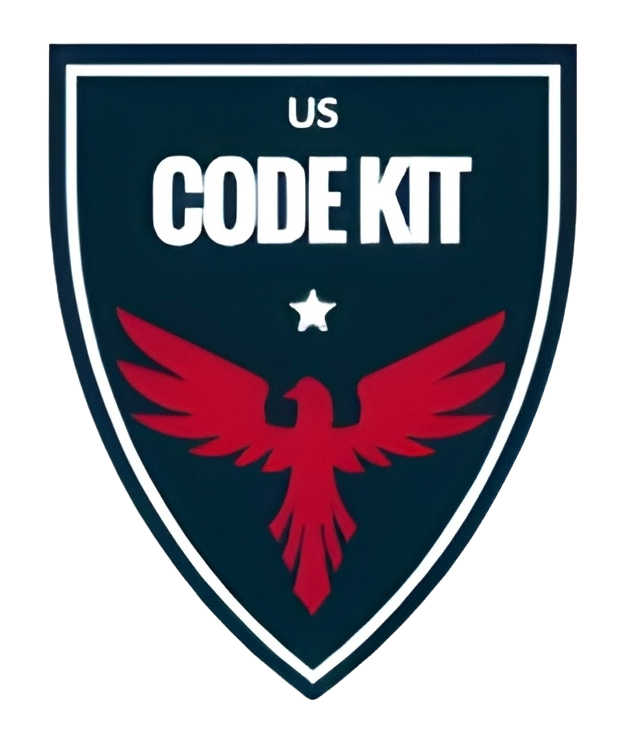

<p align="center">
  
</p>

<h1 align="center">USCodeKit</h1>

> This module provides utilities for validating, formatting, extracting, and analyzing U.S. phone numbers and codes.

## Table of Contents

- [Installation](#installation)
- [Module](#functions)
  - [phone](./phone/README.md)
  - [zip_code](./zip_code/README.md)
  - [NAICS](./naics/README.md)
- [Resource Setup Guide](./setup/README.md)
- [Usage](#usage)

## Installation

Using `pip`

```bash
pip install uscodekit
```

Using `poetry`

```bash
poetry add uscodekit
```

## Usage

Each function can be used independently for phone number and ZIP code manipulation and validation, or combined to build comprehensive data processing flows related to contact and location information.
